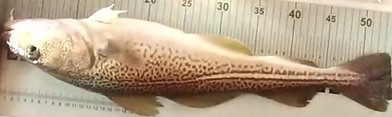
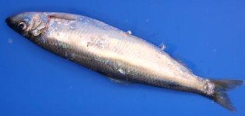
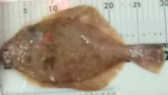
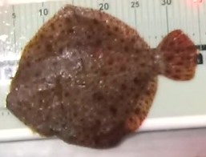
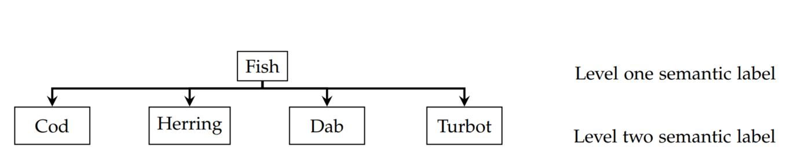
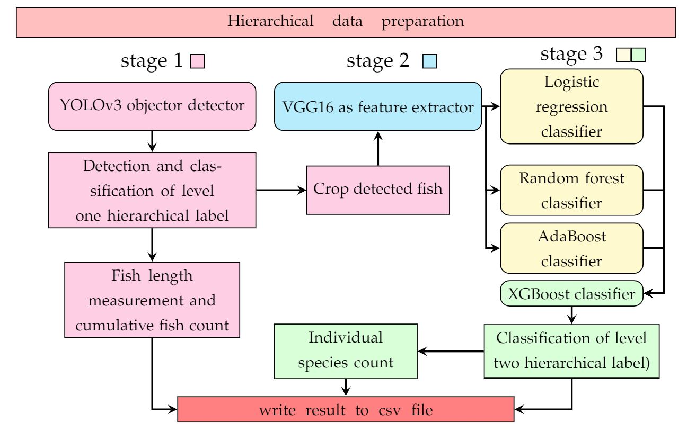

# Classification of fishe species using Model stacking approach  

To study the commercial fish stock, marine data is collected by preforming biological sampling. The conventional Biological sampling procedure includes sorting the catch into species, measuring the length and counting the number of the individual catch. This conventional technique in use is labour intensive and time consuming. To automate this process, we developed a hierarchical fish classification framework using convolution neural network, and machine learning classifiers to classify four different fish species.

# Datasets

We used two public and one custom dataset. The two public datasets are QUT FISH and Open image dataset. The examples in the public datasets are labelled with single label Fish and acts as the level one label of the semantic hierarchy. The custom dataset is captured in the laboratory at "Thünen-Institute (OF)" and in the fishery research vessel "Solea". Therefore, the dataset is named "Thünen dataset". The thünen dataset contains level one and level two label of the semantic hierarchy for each example in the dataset 

<figure>

  

  <figcaption>(a) Cod (b) Herring (c) Dab (d) Turbot.</figcaption>
</figure>

<figure>

<figcaption> Hierarchical annotation of the dataset</figcaption>
</figure>

# Architecture of the framework 
<figure>

<figcaption>Architecture of the framework </figcaption>
</figure>
# Folder structure 
<figure>

<figcaption>Architecture of the framework </figcaption>
</figure>
# Gudeline to use the source code
1. 
